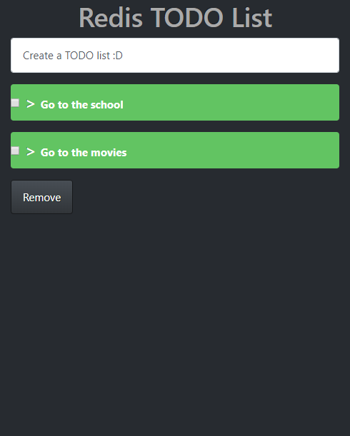

# redis-TODO-List

This is TODO List made using **Redis**, **EJS**, **Express**, **Node.js** and **Bootstrap 4**. Where you can write and delete any element that you want.

## Project preview


## Getting started:
If you want to view the web application in your computer, first you need to have Installed [NodeJS](https://nodejs.org/es/), second you will need to install a [Redis Server and CLI](https://redis.io/download), finally you will need to type the following instructions on your terminal inside the project folder 
```shell
npm install 
```
and then 
```shell
node .
```
After these instructions, open your browser and go to the next url [http://localhost:3000/](http://localhost:3000/)

### Details about the project and code
---
* The server where the data is storage is Redis and it is saving the data in a list element.
* Using a Redis client we can write, read and delete the elements of the list.
* You can install the Redis client by using the following instruction: 
  ```shell
  npm install redis --save
  ```
* Use ``client.RPUSH('key', value)`` to insert a value to the right of the elements
* Use ``client.LRANGE('key', 0, -1)`` to get all the values of the list
* Use ``client.LREM('key', 0, 'value')`` to remove an element of the list by value


For **Redis** client declaration you can use the following instruction inside where you need it

```js
const client = redis.createClient();

client.on('connect', () => {
  console.log('Connected to Redis...');
});
```

### Dependencies used for this project are:
---
* body-parser: 1.18.3
* ejs: 2.6.1
* express: 4.16.3
* redis: 2.8.0
